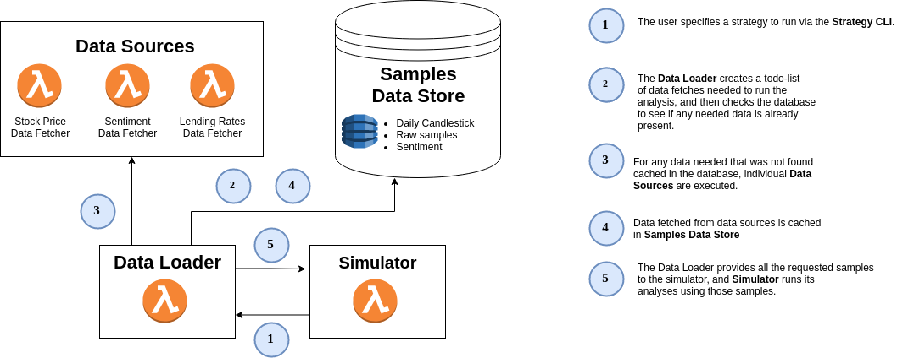

# Stock Analysis Design

## User Stories

### User Story 1: Trading Strategy Tester

As a stock market trader, I'd like to quickly experiment with trading strategies to employ in automated or manual trading.

#### Rules and Strategies

**Rules** are the core of the strategy tester. A trading **strategy** can be defined simply as a set of rules. Each rule includes two parts. First, an **action** must be defined. This can be buy, sell, put, or call on a specific asset (perhaps more to come). Second, a **condition** must be described. A rule's condition is a set of requirements which must be met before taking the associated action. For example, a user may define a rule `put 12 SPY when ($elite_sentiment("SPY") - $common_sentiment("SPY")) > 0.3`, meaning "buy puts on SPY whenever the sentiment of the insiders is much greater than public sentiment" (by a certain margin).

#### Indicators

**Ultra-simple**

- Stock value (`value(ticker: string)`)
- Historical value (`value_at(ticker: string, time: Time)`)
- Trailing Limit (`trailing_limit(percent: float): bool`)

**Numeric analysis on market data**

- Linear Regression (`linear_regression(samples: int): float`)
- RSI (`rsi(samples: int): float`)

**Public sentiment**

- "Common class" sentiment (`common_sentiment: float`)
  - Twitter   (if filtered properly, only users w/ relatively low # of followers?) (`twitter_sentiment: float`)
  - FB        (^) (`facebook_sentiment: float`)
  - Instagram (^) (`instagram_sentiment: float`)
  - Reddit (`reddit_sentiment: float`)
  - etc.
- "Elite Class" sentiment (`elite_sentiment: float`)
  - Bloomberg (`bloomburg_sentiment: float`)
  - Forbes (`forbes_sentiment: float`)
  - Entrepreneur (`entrepreneur_com_sentiment: float`)
  - WSJ (`wsj_sentiment: float`)
  - etc.
- Total public sentiment (`sentiment: float`)
  - Total of all previous indicators

**Structural conditions**

- Lending rates (`lending_rate: float`, `recently_changed_lending_rate(by_at_least: float): bool`)
- Presidential approval rating (`presidential_approval_rating: float`)

**Machine Learning**

- Reinforcement learning (each model has a name)
  - Potential Inputs: price history, all other indicators

#### Example Strategy

An example strategy might have the rules:

- `sell AAPL when $value("APPL") - $value_at("APPL", "3 days ago") > 12` (trailing limit)

#### Executing a Strategy

In order to execute a strategy, the user specifies the strategy and provides the date range to run strategy on as an additional input parameter.

Output is:
- Total success of the strategy over the course of the date range.
- Log every time a rule is executed.
- Log every time a rule's sub-condition changes (only if `-v`).

The data fetching subsystem will fill in any missing data in the database, then the analysis subsystem will run the requested analysis by querying the DB directly.

Example:

```
$ <command> --strategy simple.strat --start <date> --end <date>
```

Output:

```
{#for each sample}
{
  "time": "<datetime>",
  "strategy": "simple.strat",
  "rule": "my_rule1",
  "result": false,
  // Optional - more work to implement
  "conditions": [
    "condition": "($elite_sentiment - $common_sentiment) > 0.3",
    "result": false
  ]}
}
{/for}

Profit: -$12.43
```

### User Story 2: Fair Market Value Estimator

Using machine learning

## Implementation

The described use cases depend almost exclusively on having a well-designed database schema containing a wide array of data.



### Data Sources

#### Stock Price Data

**Live ticker data**

- Scrape from any source - google, yahoo, tradingview

**Historical Data**

- Likely need a paid data source

#### Fundamentals Data

**SEC Filings info**

Provides net profit, shareholder equity.

- Official [Financial Statements](https://www.sec.gov/dera/data/financial-statement-data-sets.html) from SEC

**GPD Data**

- [World Bank](https://data.worldbank.org/indicator/NY.GDP.MKTP.CD?locations=US)

**Total Market Cap**

- https://ycharts.com/indicators/us_total_market_capitalization (updated fairly often)
- https://siblisresearch.com/data/us-stock-market-value/

**U.S. Bureau of Economic Analysis**

- https://apps.bea.gov/API/signup/index.cfm
- GDP by industry.
- Regional income, employment statistics by county
- Monthly NIPA tables - GDP, national income, corporate profits, govt spending.

#### Social Media Data

In order of preference, we'll try to use:

- Official Libraries
- Community Libraries
- Official API
- Scraping

#### Paid Options

- finnhub or similar APIs

### Module 0: The Data Store

We need a centralized store so we can efficiently access data.

#### DB Schema

#### DB Technology

### Module 0.1: Data Fetcher

The Data Fetcher provides a convenient standardized access point to the disparate data sources

#### Desired Output

The data fetcher provides stock market data in two forms: streaming realtime data for any given stock(s), or historic data of the stock. This is provided via stdout with a JSON format.

##### Examples

**Simple usage**

Input:

```
$ <command> SPY
```

Output (streaming, printed line by line):

```
SPY,2020-08-23T03:59:04Z,11.1
SPY,2020-08-23T03:59:05Z,11.1
SPY,2020-08-23T03:59:06Z,11.1
SPY,2020-08-23T03:59:07Z,11.1
SPY,2020-08-23T03:59:08Z,11.1
SPY,2020-08-23T03:59:09Z,11.1
...
```

**Multiple tickers**

Input:

```
$ <command> SPY RUSL
```

Output (streaming, printed line by line):

```
SPY,2020-08-23T03:59:04Z,11.1
RUSL,2020-08-23T03:59:04Z,11.1
SPY,2020-08-23T03:59:05Z,11.1
RUSL,2020-08-23T03:59:06Z,11.1
SPY,2020-08-23T03:59:07Z,11.1
RUSL,2020-08-23T03:59:08Z,11.1
SPY,2020-08-23T03:59:09Z,11.1
...
```

**Historical Data**

Input:

```
$ <command> SPY RUSL --start 2020-01-23T03:59:09Z --end 2020-05-23
```

#### Inputs

- A list of stock tickers
- Start and end dates/datetimes (optional, default realtime)

### Module 0.2: Data Store

#### Desired Functionality

HTTP server which proxies requests to the Data Fetcher and caches results in a database to serve future requests.

### Data Schema

- Samples
  - `PointInTimeSample(ticker: string, indicator: string, time: datetime, value: float)`
    - Point-in-time stock market data
    - Sentiment analysis on content gathered at a specific time
  - `TimeRangeSample(ticker: string, indicator: string, start: datetime, end: datetime, value: float)`
    - Sentiment analysis on content which was published between an interval
  - `CandlestickSample(ticker: string, start: datetime, end: datetime, open: float, close: float, high: float, low: float)`
    - Candlestick market data

#### API calls

**GET /candlestick/**

#### Common Access Patterns by Use Case

##### Testing a Trading Strategy

When a user wants to test a trading strategy, we will likely only need daily candlesticks of specific stocks.

### Module 1: Numeric Analysis

#### Desired Output

Predicted future direction and magnitude of confidence of numeric time-series data (ex. stock prices),
with output represented as a floating point number.

#### Inputs

- Time-series data, with history

#### Implementation(s)

Many possible learning strategies:

- Linear Regression
- Deep learning (neural net)
- Basesian
- Reinforcement learning
- Or some combination of the above

### Module 2: Sentiment Analysis of the Common Class

#### Inputs

- Public Digitial Communications, along with time information
  - Tweets about a specific stock
  - Reddit posts about a stock

### Module 3: Sentiment Analysis of the Elite Class

### Inputs

- Media
  - Fox
  - CNN
  - MSNBC

### Master Module

### Desired Output

Predicted future direction and magnitude of confidence, of a given piece of numeric time-series data (ex. stock prices),
represented as a floating point number.

### Inputs

- All the outputs from the other systems


### Module X: Fair Market Value Neural Network

### Inputs

A standardized set of information about a company's Fundamentals. This may include return on equity, earnings, debt ratio, relevant interest rates, country of formation, etc.

https://www.investopedia.com/terms/f/fundamentalanalysis.asp

### Desired Output

Expected Fair Market Value of the company

### Training

We know the current "Fair Market Value" of all companies - just find an API for business fundamentals and stock price, pull the data, and find correlations.
